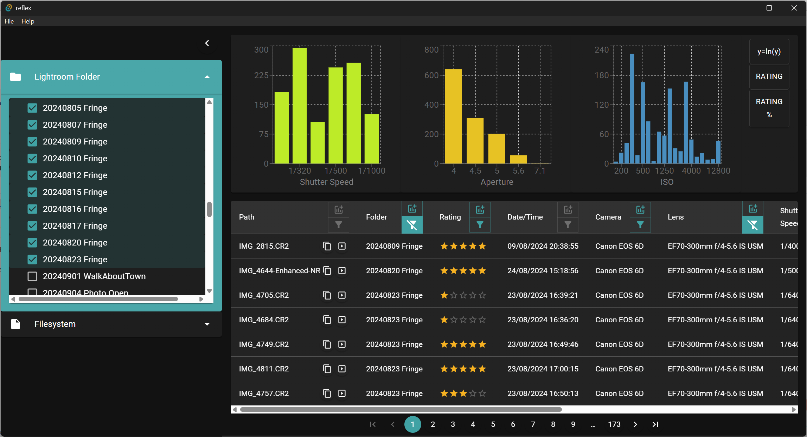
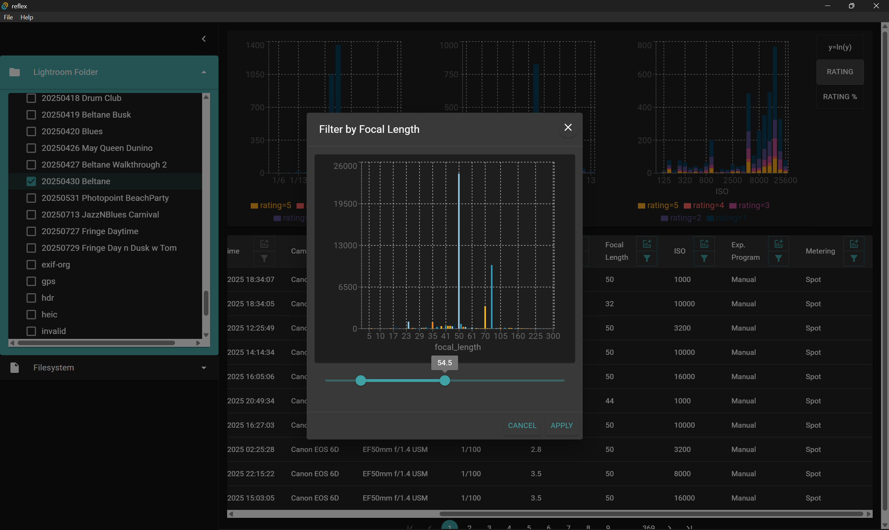
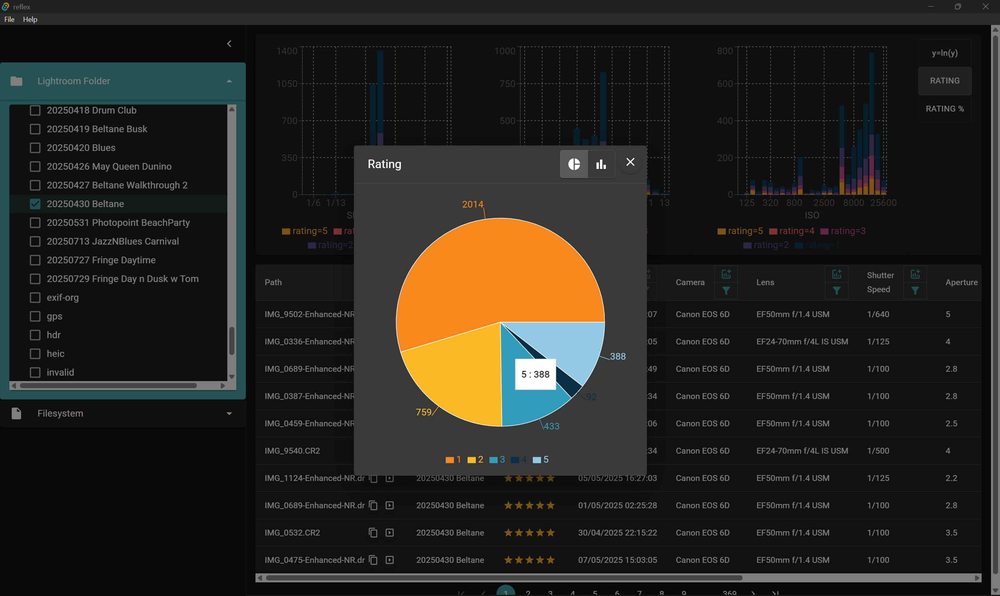
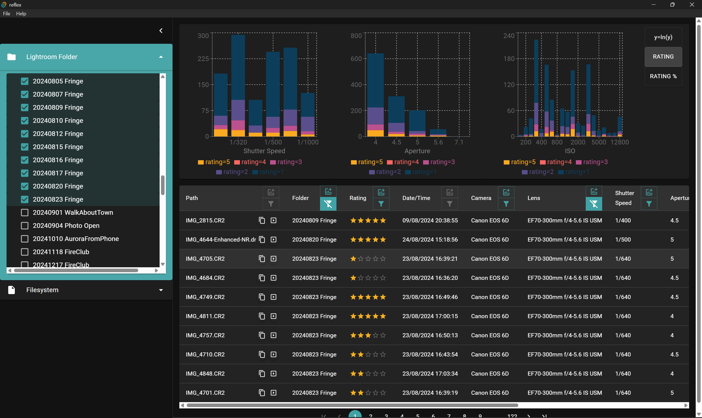

# reflex

# Contents

- [Overview](#overview)
- [Screenshots](#screenshots)

## Overview

Reflex is an under-development app which lets you learn about how you take photographs.
Do you really use that lens? Or, which apertures tend to produce your _most loved_ photos?

Reflex links directly to your Adobe Lightroom catalogue. There's currently _limited_ support for inspecting photos not indexed by Lightroom.

Reflex is written with Rust and [Tauri](https://tauri.app).
If you want to build it, read Tauri's [Getting Started](https://tauri.app/start/prerequisites/) for the prerequisites.

## Screenshots

### Filter the photos on display to drill down into the details

### A variety of different graphics to choose from

### Compare your final ratings for each photo

